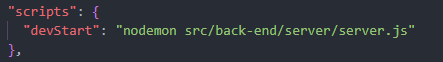

# Workflow Setup 3.00

Maintaining big development projects can be challenging due to their complexity and the number of moving parts involved. However, it should not be hard if proper planning, organization, and communication are in place. Establishing clear goals, timelines, and responsibilities, as well as using appropriate project management tools and methodologies to help ensure that the project stays on track and all team members are aware of their tasks and deadlines. Ultimately, with the right approach and mindset, maintaining big development projects can be a manageable task and this is what I try to achieve with this project.

## Project Links

[Index](https://tertiusroach.github.io/workflow-setup_2.01/index.html)

## Install NPM Commands for Node.js

---

    npm init -y

---

    npm install gulp
    npm install sass
    npm install jquery
    npm install bcrypt
    npm install express
    npm install mongodb
    npm install bootstrap
    npm install typescript

---

    npm install --save-dev gulp
    npm install --save-dev gulp-sass
    npm install --save-dev gulp-clean
    npm install --save-dev gulp-concat
    npm install --save-dev gulp-uglify
    npm install --save-dev gulp-rename
    npm install --save-dev gulp-htmlmin
    npm install --save-dev gulp-uglifycss
    npm install --save-dev gulp-typescript
    npm install --save-dev gulp-sourcemaps
    npm install --save-dev gulp-delete-file
    npm install --save-dev gulp-string-replace
    npm install --save-dev gulp-remove-html-comments

---

    npm install --save-dev nodemon
    npm install --save-dev @types/jquery
    npm install --save-dev @google/clasp

---

## Checklist

1 - [Learn MongoDB](https://www.youtube.com/watch?v=fbYExfeFsI0&t=382s&ab_channel=MongoDB)

2 - [Secure Login (Back-end)](https://www.youtube.com/watch?v=-RCnNyD0L-s)

3 - [Connect Database (Back-end)](https://www.youtube.com/watch?v=fgTGADljAeg)

4 - [AWS & MySQL (Back-end)](https://www.youtube.com/watch?v=6Nt-Jl3CzxE)

5 - [Translate Country (Back-end)](https://www.youtube.com/watch?v=NA_mgK4Vrps)

6 - [Country List (Reference)](https://www.infoplease.com/countries/languages-spoken-in-each-country-of-the-world)

7 - [Alpha Codes (Reference)](https://www.iban.com/country-codes)

8 - [Translate API (Back-end)](https://www.nodejsera.com/how-to-use-google-translator-with-nodejs.html)

9 - Combine Bootstrap into style.css using Gulp

10 - Copy server side files into dist using gulp

## RequireJS (Notes)

---

    npm install requirejs

---

## MongoDB (Setup)

I'm using [this video](https://www.youtube.com/watch?v=fbYExfeFsI0&t=382s&ab_channel=MongoDB) as the guide to implement the connect.js code.

---

    npm install mongodb

---

Open "Extensions" in the left navigation of [Visual Studio Code](https://code.visualstudio.com/) and search for MongoDB for VS Code by MongoDB and install it. Click on the "View" dropdown and open Command Palette. Search "MongoDB: Connect" on the Command Palette and click on Connect with Connection String.

## bcrypt (Setup)

I used this [video tutorial](https://www.youtube.com/watch?v=Ud5xKCYQTjM) to implement bcrypt security into my workflow. Install the following packages and install REST Client by Huachao Mao for Visual Studio Code to help with testing.

---

    npm install bcrypt
    npm install express
    npm install --save-dev nodemon

---

Open the [package.json](src/vendors/images/png/screenshots/user-authentication/json-file.png) before replacing the following text...

"test": "echo \"Error: no test specified\" && exit 1"

...with the folder location in the picture shown below. This will allow you to run the server test with the following command on a local machine, **npm run devStart**.

[This video](https://www.youtube.com/watch?v=-RCnNyD0L-s) is a more in depth guide on how to set it up. The workflow differs but the concepts remain the same. Install the following applications to authenticate logins and figure out how to do the logins with TypeScript...

---

    npm install passport
    npm install express-flash
    npm install passport-local
    npm install express-session

---

## Clasp (Setup)

This [video tutorial](https://www.youtube.com/watch?v=4Qlt3p6N0es&t=437s&ab_channel=LearnGoogleSheets%26ExcelSpreadsheets) for [Clasp](https://github.com/google/clasp) helped me setup [Google Sheets](https://www.google.com/sheets/about/) for the workflow. To link [Apps Script](https://developers.google.com/apps-script/reference/spreadsheet) with [Visual Studio Code](https://code.visualstudio.com/). Remember to enable your [Google Apps Script API](https://script.google.com/home/usersettings) to give Visual Studio Code permission to change the code associated with [Apps Script](https://developers.google.com/apps-script/reference/spreadsheet) coding interface. Install Google clasp using [Node.js](https://nodejs.org/en/) onto your computer before using [Node Package Manager](https://www.npmjs.com/) commands inside your [terminal](src/vendors/images/png/screenshots/google-clasp/terminal-screenshot.png).

    npm install --save-dev @google/clasp

Confirm if the clasp CLI is installed with this terminal command.

    clasp -v

Log into your Google account by typing 'clasp login' into the terminal and press enter. This will open a browser for you to log into your account.

    clasp login

Get the [Apps Script ID](src/vendors/images/png/screenshots/google-sheets-id.png) you want to link to [Visual Studio Code](https://code.visualstudio.com/). There should also be a specification of the folder location for the JavaScript files. My folder storage location is "[src/apps/clasp/](src/vendors/images/png/screenshots/clasp-folder-location.png)" but you can change it accordingly. Replace ["G3T*yOuR_ScR!pT_iD_aNd_C0Py*!t_H3rE"](src/vendors/images/png/screenshots/google-sheets-id.png) inside the [.clasp.json](src/vendors/images/png/screenshots/clasp-json.png) file with the [script ID](src/vendors/images/png/screenshots/google-sheets-id.png) before using the following [clasp](https://github.com/google/clasp) command.

    clasp clone "G3T*yOuR_ScR!pT_iD_aNd_C0Py*!t_H3rE" --rootDir src/apps/clasp/

Move the [.clasp.json](src/vendors/images/png/screenshots/clasp-json.png) found in the "[src/apps/clasp/](src/vendors/images/png/screenshots/clasp-folder-location.png)" directory to use into the root folder: [VSC](https://code.visualstudio.com/) will reference the .clasp.json file in your root directory with minimal code changes every time you want to switch projects. If the .clasp.json file is configured correctly by changing the [script ID](src/vendors/images/png/screenshots/google-sheets-id.png) and matching the [folder directory](src/vendors/images/png/screenshots/clasp-folder-location.png) to {"scriptId":"[G3T*yOuR_ScR!pT_iD_aNd_C0Py*!t_H3rE](src/vendors/images/png/screenshots/clasp-json.png)","rootDir":"[src/apps/clasp/](src/vendors/images/png/screenshots/clasp-folder-location.png)"}. Use the following [terminal](src/vendors/images/png/screenshots/terminal-screenshot.png) commands.

    clasp pull
    clasp push -w

Now you're ready to use Visual Studio Code and its extensions for a better coding experience!

## Gulp (Setup)

The 'gulpfile.js' contains the code to automate this workflow. I followed this [gulp crash course](https://www.youtube.com/watch?v=1rw9MfIleEg&ab_channel=TraversyMedia) and expanded on it to accommodate this folder layout. To imbed [it](https://en.wikipedia.org/wiki/Gulp.js) into VSC (Visual Studio Code) install the extension [Gulp Tasks](https://marketplace.visualstudio.com/items?itemName=nickdodd79.gulptasks) by Nick Dodd.

The written functions should work if it corresponds with the folder layout of this repository.

The [npm commands website](https://www.npmjs.com/package/gulp) for Gulp is a great resource when adding extra features and you will also need to know what [Node.js](https://nodejs.org/en/) is before continuing further. The npm (Node Package Manager) commands for Gulp are listed below and can be copied and pasted into the terminal for easy installation.

## Bootstrap (Setup)

All this time I tried to solve problems which [Bootstrap](https://getbootstrap.com/) already figured out. Here's the [documentation](https://getbootstrap.com/docs/5.3/getting-started/introduction/) and below is the npm installation command.

    npm install bootstrap

# Notes

I tend to word on the wrong files so it might be a good idea to [hide the page folders](https://www.w3schools.io/editor/vscode-hide-files-folder/) that are already archived.

1. Open Visual studio code
2. Go to File > Preferences > Settings
3. Opened the settings page
4. type “files:exclude” in search settings
5. In Files:Exclude Section, Click on the Add Pattern button
6. It enables the input box and types folder or file name inside it. Click Ok to save it.
7. Inside the text box, you can add folders, files, or regular expressions to point the path of the file.

# Asset links

[README.md](https://www.markdownguide.org/cheat-sheet/) cheat sheet.

[Build Login (Reference)](https://www.youtube.com/watch?v=hKqbOmVrNZI)

### Visual Studio Code (Setup)

Press (Ctrl + ,) or go to File -> Preferences -> Settings andd search for 'Exclude' to open to hide any clutter.
Press (Ctrl + alt + s) to save without prettier reformatting the file.

---

# TESTING REPOSITORY RELOCATION
# workflow-setup_3.00
